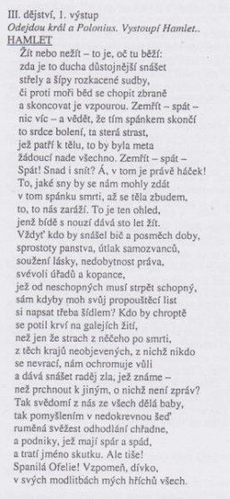

{/ ../kontexty/renesance /}

{/ ../autori/shakespear /}

# Kniha
## Obecně
### Téma
pomsta bratrovraždy

### Motivy
* vnitřní dilema Hamleta - vykonat, či nevykonat pomstu
* na jedné straně je chladná racionální touha po pomstě, na druhé straně člověk filosoficky založený, meditující - rozporuplné monology → napětí
* Pomstít chtěl bratrovraždu jeho otce - bratrem Klaudiem
* Dvojí jazyková rovina - vážnost x momenty šílenství 

### Časoprostor
16\. století, Dánsko, hrad Elsinor

### Stavba
* 4 dějství
* chronologické

### Žándr a druh
tragédie, drama

## Postavy
### Hamlet
* ptá se na otázky, na které nelze jednoznačně odpovědět, filosofuje
* nerozhodný melancholik, impulzivní jednání
* silný smysl pro spravedlnost
* posedlost smrtí, sebevraždou, posmrtným životem
* nespokojený s politickou situací Dánska, chováním matky, prakticky se vším
* špatný vztah k ženám

### Claudius
* posedlý mocí
* lstivý, zbabělý, výřečný, manipulativní

### Gertruda
* záhadná postava (láska k manželovi i Claudiovi), otázka, zdali věděla, že král byl zavražděn
* vždy volí tu nejbezpečnější možnost, není tak nerozhodná jako Hamlet
* závislá na mužích, matka Hamleta

### Ofélie
* dcera Polonia, Hamletova láska, svoje city skrývá, nedokáže je Hamletovi sdělit, svěřuje se svému otci a Claudiovi, je trochu zbabělá

# Děj
Dánský král umírá za podivných okolností a kralevic Hamlet se od přízraku svého otce, který se každou noc prochází po hradbách hradu Elsinoru dozvídá, že za smrt je zodpovědný Hamletův strýc a králův bratr Klaudius. Ten nalil během spánku do králova ucha jed a stal se novým vládcem Dánska. Hamlet se rozhodne, že smrt svého otce pomstí, a aby zmátl své okolí, žačne předstírat šílenství. Protože se chce přesvědčit o vině svého strýce, využívá návštěvy kočovných herců na hradě a zinscenuje s nimi divadelní představení, jehož děj zobrazuje události při otcově vraždě. Klaudius je hrou otřesen. Důležitým momentem je smrt nejvyššího komořího Polonia, přívržence Klaudia, jehož dceru Ofélii Hamlet miluje. Polonius je Hamletem náhodně zabit, když stál za závěsem v ložnici královny a naslouchal. Klaudius se chce Hamleta zbavit, a proto jej s bývalými princovými spolužáky posílá do Anglie. Hamlet však tuší léčku, zmocní se tajně dopisu, který žádá Hamletovu smrt, zamění jej a výsledkem je poprava obou doručitelů, kteří pomáhali Klaudiovi Hamleta špehovat. Hamlet se vrací zpět do Dánska. Na hřbitově se setkává s přítelem Horaciem a s hrobníky, kteří právě vykopávají hrob pro Ofélii, jež se z nešťastné lásky k Hamletovi pomátla a utopila. Oféliin bratr Leartes se vrací z Francie, aby pomstil smrt svého otce. Je však využit Klaudiem, kterému se Leartův návrat velice hodí. Dochází k souboji mezi Hamletem a Leartem – Hamlet sice v souboji vítězí, ale Leartův rapír je otráven, a tak i zraněný Hamlet pomalu umírá. Ještě před svou smrtí však zabíjí krále a je svědkem i matčiny smrti, která náhodou vypila pohár otráveného vína, jenž byl původně určen pro Hamleta. Na poslední chvíli ještě Hamlet zabrání sebevraždě Horatia, neboť jediný on může objasnit celý tragický příběh.

# Ukázka
