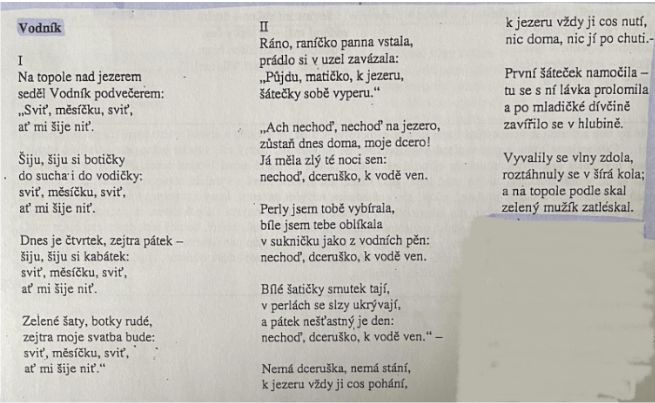

# Kontext
* 30\. léta 19. století

{/ ../kontexty/romantismus /}

# Autor
* 19\. století
* právník, sekretáž v muzeu, archivář × Mácha (pravý romatik)
* nebyl romantik životním stylem ani textem
* hrdina se nebouří, přijímá osud
* popis přírody
* čas je vedlejší, všechno důležité během krátké doby (např. Polednice - během úderů hodin)
* baladická zkratka
* nezájem, co bude potom
* vyrovnání s Máchou v Záchořově loži
* komponovanost, etičnost
* sběratel pohádek
* zakladatel české moderní balady

# Kniha

## Obecně
* kniha zapadá přesně do 19. století, kdy se těšilo všeobecnému zájmu studium lidové slovesnosti (Erben chtěl poodkrýt lidové pověsti, písně, obyčeje - spatřoval v nich svědectví o charakteru a duchu českého národa, byly mu důkazem existence původního českého respektive slovanského etnického základu)
* vymanil se z předešlé ohlasové poezie (Čelakovský) - Kytice je umělecky zcela původní
* prastaré lidové mýty i Erbenova filozofie (například až úzkostlivý vztah mezi matkou a dítětem)
* 13 balad bylo tvořeno po dobu téměř 20 let
* komponovanost a etičnost
  - komponovanost = předem rozmyšlené rozvržení básní, osové řazení balad, zrcadlově 	protilehlé básně mají shodné atributy (Polednice - Vodník= nadpřirozené bytosti zasahující do porušených etických vztahů, Štědrý den - Holoubek= založený na lásce a smrti)
  - etičnost = tvrzení, že se jedná o pouhou osudovost, fatálnost vstupuje do popředí jen ve Štědrém dnu a ve Věštkyni (ostatní básně - porušování vzájemných vztahů, překročení 	hranic), vazba matka a dcera je považována za nejužší a nejzákladnější (trestání matky až 	příliš krutě - vyhrocení dvojí vazbou)
* dramatický účinek 
  * dějová zkratka
  * popisy přírody
  * zhuštěný děj s úsporným jazykem (neslovesné věty, absence spojek, místo sloves citoslovce)
  * dialogy
  * zvukomalba (onomatopoie)

### Téma
* nadpřirozené bytosti zasahujících za porušení etických vztahů
* často nepřiměřený trest
* člověk je bezmocný
* mezilidské vztahy, vina a trest

### Motivy
* mateřská láska, poučením vina, vykoupení, ...

### Časoprostor
asi během Erbenova života, česká krajina

### Stavba
* 13 balad
* komponovanost
  * `i`. a `kytice.len - 1 - i`. mají stejný motiv a téma

### Žándr a druh
soubor balad, lyricko-epický

# Děj
## Vodník 
Dcera i přes matčiny námitky jde prát šátky do rybníka, propadne se pod ní lávka a dostává se do vodníkova světa. Stává se nedobrovolně jeho ženou a má s ním i syna, její jediné potěšení. Nakonec ho přemluví, aby ji pustil naposledy se rozloučit s matkou. Dovolí jí to od klekání do klekání a nesmí nikoho objímat. Matka nechce dceru pustit, schovají se proto v komoře. Přichází vodních, chce večeři, rozestlat, pak nakrmit dítě. Matka dceru nepouští a říká mu, ať dítě přinese. To on udělá, ale utrhne mu hlavu.

## Zlatý kolovrat 
Pán se zastaví v chaloupce a zamiluje se do prosté Dory a chce si ji vzít. Její nevlastní matka mu chce ale provdat druhou dceru, proto společně cestou v lese Doru zabijí, odeberou jí nohy, ruce a oči. Král nepozná rozdíl, vezme si druhou dceru. Odjíždí do boje. Mezitím stařeček v lese nachází tělo a posílá své páže do zámku prodávat zlatý kolovrat, přeslici a kuželíček za nohy, ruce a oči. Ty připojí k tělu, Dora ožije. Když chce sestra pánovi něco upříst, kolovrátek mu prozradí celý příběh. Pán Doru najde a vezme si ji. Matce a sestře udělá to, co ony Doře.

## Svatební košile 
Osamělá dívka se modlí k panně Marii a myslí na svého milého, jenž už dávno odešel do války a pro něhož tkala košile. Tu se on objevuje za oknem a nabádá ji, ať s ním jde pryč. Dívka poslechne a letí s ním. Cestou odhazuje modlicí knížky, růženec a křížek po matce. U hřbitova pochopí, co se na ni chystá a lstí donutí upíra skočit přes zeď prvního. Sama se mezitím schová v márnici. Pak ona i upír přesvědčují umrlce a nakonec kokrhá kohout a tím je zachráněna.

## Záhořovo lože
Otec upsal syna ďáblu a ten se vydává do pekla získat listinu zpět. Cestou potká Záhoře, jenž ho chce zabít (jako spoustu jiných poutníků), ale nakonec se domluví, že ho nechá, když se pak chlapec vrátí a poví mu, jak to v pekle vypadá. Za rok se chlapec vrací a vypráví, že Satan nakázal pod pohrůžkou křížem listinu vydat, ďábel však neposlechl, ani pod výhrůžkou mučení pekelnou koupelí a železnou pannou. Až při výhrůžce Záhořovým ložem blánu vydal. Záhoř se zděsí a poutník mu poradí, aby se kál a modlil, dokud se k němu nevrátí. Také zarazí jeho zabijácký kyj do skály. Za devadesát let se poutník vrací jako biskup se svým pomocníkem. Chce se občerstvit, a pomocník najde růst za skály krásnou jabloň, vedle stojící pařez zakazuje mu utrhnout jablko, neb ji nesázel. Když strom uvidí biskup, může utrhnout, protože vyrostl ze zaraženého kyje. Šťastně se shledá se Záhořem - mluvícím pařezem a pak oba v klidu zemřou a jejich duše se promění v holubice.

### Další básně
* Poklad
* svatební košile
* kytice
* polednice
* dceřina kletba
* štědrý večer
* holoubek
* vrba
* lilie
* věštkyně

# Ukázka
