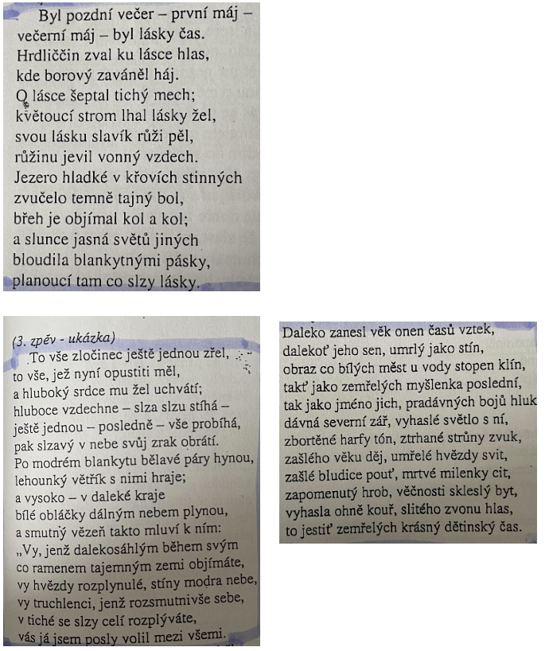

# Kontext
* 30\. léta 19. století

{/ ../kontexty/romantismus /}

# Autor
* pravý romantik
* žárlivá láska a tak, rozervanost, rozpor mezi snem a skutečností
* novočeský jamb
* autobiografické
* strach z budoucnosti
* příroda, tragické osudy
* hrady, pěší tůry

# Kniha
## Obecně
* vrcholné dílo českého romantismu (motiv tragické lásky)
* prostý děj s historickým základem odehrávající se v krajině kolem Bezdězu
* reakce na vydání Máje 
  * vlna odporu a záporné kritiky
  * vadila Máchova rozervanost
  * zcela nové pojetí vlastenectví
  * je filozofičtější, hrdina je vrah, výrazná individualita
  * nevýchovné, temnost, ponurost děje
  * žádný ohled na společnost - klasicistní rys
* Mácha měl jako první odvahu vyslovit své city, zklamání, pochybnosti
* ve středu pozornosti je tragédie mladého člověka, který zavraždil (jenže několik osudových náhod svázalo tragédii jednoho člověka se životy dalších postav)
* tragédie lidí míří jednoznačně k obvinění společnosti
* marná vzpoura jedince (začarovaný kruh - společnost trestá, ale neptá se po příčinách, msta se nakonec obrátí proti skutečnému původci dramatu)
* tragédie obecně lidská - otázky kladené ve vězení Vilémem jsou vlastně Máchovou obžalobou celé společnosti
* autorovo myšlenkové ztotožnění s hrdinou (4. zpěv, závěrečné zvolání - Mácha splývá s postavou Viléma, subjektivnost básně)
* úvahy o lidské existenci, posmrtné nicotě (ve vězení)
* kategorie času - čas je prožíván subjektivně, je formou vnitřního smyslu (Mácha se netají strachem z budoucnosti, posmrtného života a nicoty)
* máchovská melancholie - typický pocit prchání, pocit zániku všeho jednotlivého (pouhý osobní sentiment nebo ucelený názor na povahu času a věčnosti s filozofickou interpretací)

### Literární žánr
* lyricko-epická báseň (poéma)

### Literární druh
* lyrika 

### Časoprostor
* pravděpodobně z dob romantismu, okolí Bezdězu

### Kompozice
* dedikace (věnování)
* 4 zpěvy
* 2 intermezza (chronologický postup s retrospektivními prvky)

### Téma
* pomsta

### Motiv
* tragédie mladého člověka
* marná vzpoura jedince
* autorovo myšlenkové ztotožnění s hrdinou
* láska
* kategorie času
* citlivé vlastenectví
* máchovská melancholie

### vypravěč / lyrický subjekt
* er-forma (autor, vševědoucí vypravěč) 

### typy promluv
* monology, dialogy 

## Postavy
### Vilém
* loupežník
* zamilovaný do Jarmily
* žárlivý, pomstychtivý, nešťastný, smutný
* otcovrah

### Jarmila
* krásná, nešťastná
* zamilovaná do Viléma
* poctivá, oddaně čeká na Viléma
* svedena otcem Viléma

### poutník Hynek
* vystupuje ve 4. zpěvu, sám autor
* zamyšlený, vrací se k Vilémovu popravišti

### otec Viléma
* nečestný
* svůdce Jarmily

# Děj

Obávaný vůdce loupežníků Vilém zabil svého soka v lásce, aniž však věděl, že je to jeho vlastní otec, který ho v dětství vyhnal z domu - kvůli němu se Vilém stal loupežníkem. Vězeň Vilém v noci před popravou přemýšlí o svém osudu, loučí se se životem a vzpomíná na svou milou Jarmilu, kterou jeho otec svedl. Svou vinu odmítá, sám sebe vidí jako oběť sobeckého, nemilujícího otce. S Vilémem soucítí též žalářník, zdrcený tím, co mu o sobě Vilém vyprávěl. Po hodinách plných samomluv, kde vystupuje smrt jako definitivní konec života, je nešťastný otcovrah brzy ráno odveden na popraviště, doprovázen modlícím se davem. Uprostřed májové přírody se v slzách loučí s milovanou zemí. Tomuto příběhu předchází v 1. zpěvu scéna, v níž Jarmila marně čeká za májového večera na Viléma a dozvídá se o jeho osudu. V závěrečném zpěvu přichází na místo popravy poutník Hynek (představující samotného Máchu), kterého zasáhne, když uvidí kostlivce v kole a ztotožňuje se s Vilémem („…na tváři lehký smích, hluboký v srdci žal…'“).

# Ukázka
