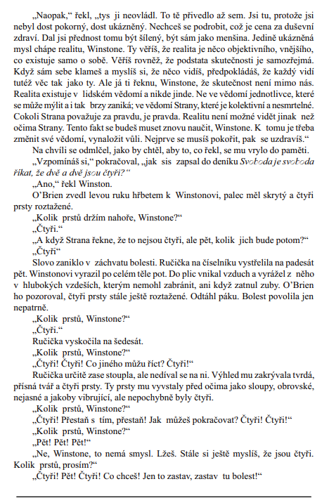
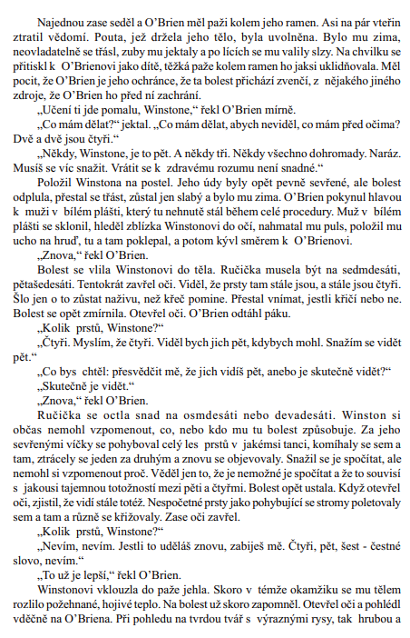

# Kontext
* 2\. polovina 20. stol (1950 až 2000)
{/ ../kontexty/po2sv_svet /}

{/ ../autori/orwell /}

# Kniha
## Obecně
* Orwell vycházel z díla ruského emigranta J. Zamjatina (kniha My), proto v Orwellově knize nacházíme převzaté postavy a podobné motivy
* Orwell znal ruské likvidační tábory
* jednoduchá výstavba, je tak trochu v kontrastu se sugestivností obsahu
* děj je občas porušován ukázkami z dokumentů, které se Winstonovi dostávají do rukou
* jedná se o postupné a celkem racionální odhalování zrůdnosti systému
* důležitou roli zde hraje detailní popis prostředí
* Winston Smith je dominantní, ostatní postavy jsou jen epizodicke (O´Brien)
* kniha je přesvědčivým zpodobněním totalitního státu, zvrácené ideologie (Oceánie) - Velký bratr (symbol totalitního vůdce)
* román je o zničení člověka státní mašinérií dovedenou až do absolutní dokonalosti (jedinec je degradován na zvířecí bytost, které jsou upírány i fyzické potřeby)
* absolutní odlidštění lze vidět na povinném spisovném jazyku - degenerovaný a okleštěný newspeak (novořeč, záměrně budovaný tak, aby nežádoucí myšlenky nemohl člověk nejen domýšlet, ale ani vyslovit, aby byl zbaven veškeré kritičnosti)
* frázovitá hesla (“Svoboda je otroctví” - paralela s totalitními systémy po válce)
* citace (“Strana se nezajímá o konkrétní činy, my se staráme jen o myšlenky. My své nepřátele neničíme, my je měníme” - jednoznačná interpretace, mít absolutní moc nad myšlením)
* kniha je varováním, výstrahou (její smysl je nadčasový, má obecnou platnost)
* imaginace a prozíravost autora
* frazeologie - Velký bratr, newspeak
* filmová adaptace

### téma
* ukázka života jedince v totalitním systému
* vyobrazení dokonalé diktatury

### motiv
* nacionalismus
* manipulace
* diktatura
* totalita
* cenzura
* sledování
* odposlech

### časoprostor
* 2\. pol. 20. st., Londýn (Anglie)

### kompoziční výstavba
* 3 části, 23 kapitol (chronologický postup s retrospektivními prvky)

### literární druh
* epika

### literární žánr
* antiutopický (dystopický) román

## Postavy
### Winston Smith
* 39 let starý
* zaměstnanec oddělení záznamů ministerstva pravdy (stará se o manipulaci s informacemi)
* není jako ostatní (nevěří v ideologii, vnímá manipulaci Strany a touží po lásce)
* vede si deník, do kterého zapisuje své “rouhavé” myšlenky

### Julie
* mladá žena
* tváří se jako zarytá členka Strany
* členka Antisexuální ligy mládeže (zpočátku se Winstonovi velmi hnusí)
* ve skutečnosti ji politika nezajímá
* touží po vzrušení a romantice
* s Winstonem tajně prožívají vášnivou lásku, kterou strana zakazuje

### O'Brien
* člen vnitřní strany
* Winston cítí souznění → přemýšl
* zda je O'Brien taky proti ideologii
* zasvěcuje je do fungování odboje
* dává jim knížku od Emanuela Goldsteina

### Syme
* pracuje na tvorbě slovníku Newspeaku
* vaporizován (moc inteligentní)

### Parsons
* hloupý
* typický přívrženec Strany
* jeho děti ho pravděpodobně někdy udají (zvědové)

### Pan Charrington
* Winston si u něj pronajme byt, kde nejsou obrazovky

# Děj
Děj této odstrašující vize budoucího světa se odehrává v Londýně roku 1984. Hrdinou románu rozděleného na 3 díly je devětatřicetiletý Londýňan Winston Smith. Je zaměstnancem Ministerstva pravdy, kde má za úkol zpětně upravovat veškeré zveřejněné informace tak, aby byly plně v souladu s následnou skutečností. Svět je totiž v té době rozdělen na 3 supervelmoci (Londýn náleží do tzv. Oceánie), jež vedou mezi sebou permanentní válku a snaží se navzájem zničit. Oceánie je ryzím totalitním státem, kde vše slouží zvrácené ideologii, v níž není místo pro sebemenší náznak lidské svobody či dokonce svobodného uvažování. V čele Oceánie je všemocný a povinně uctívaný Velký bratr a občané jsou rozděleni na tři neměnné vrstvy - nejvyšší byrokracii, střední kádr a proletáře. Pro manipulaci s lidmi jsou zřízeny státní instituce (např. Ideopolicie, Ministerstvo lásky) a aby bylo znemožněno samostatné myšlení, je povinným spisovným jazykem degenerovaný a okleštěný newspeak. Smith se vnitřně vzbouří proti systému a chce proti němu bojovat v rámci jakési spiklenecké organizace Bratrstvo. Současně se zamiluje do Julie, s níž udržuje pravidelný intimní styk. Oba jsou však zatčeni Ideopolicií, mučeni, sám Winston projde vymýváním mozku, zrazuje sám sebe, a nakonec skutečně začne milovat Velkého bratra, proti jehož despotismu se vzbouřil.

# Ukázka
* po zatčení, během vymývání mozku

