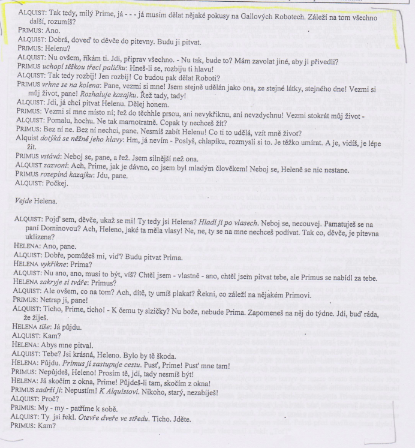

# Kontext
* po 1. sv. válce

## Demokratický proud
* spisovatele dem. proudu spojuje aktivní žurnalistická činnost v Lidových novinách (tisk dem. smýšlející populace)
* „pragmatismus“ = filosofický směr 20. století, který se zrodil v USA (W. James)
  * pro pragmatismus je charakteristický jeho zvláštní pojem pravdy (kritériem pravdy je zkušenost, praxe jednotlivce)
  * Čapek napsal, že pravdivé je pro nás poznání, které se shoduje s naší zkušeností
  * neexistuje žádná absolutní pravda, ale že pojetí pravdy je relativní

* Josef Čapek – Kulhavý poutník
* Ferdinand Peroutka - Budování státu
* Karel Poláček - Bylo nás pět
* Eduard Bass - Cirkus Humberto

## Legionářská literatura
* Rudolf Medek - Anabáze
* Jaroslav Hašek - Osudy dobrého vojáka Švejka za světové války

## Expresionismus
* Richard Weiner - Lítice
* Ladislav Klíma - Utrpení knížete Sternenhocha
* Josef Váchal - Krvavý román

## Imaginativní próza
* Vladislav Vančura - Rozmarné léto, Markéta Lazarová

## Katolická próza
* Jaroslav Durych - Bloudění
* Jakub Deml - Šlépěje

## Próza levicově orientovaných spisovatelů
* Ivan Olbracht - Anna proletářka, Žalář nejtemnější
* Marie Majerová - Siréna
* Marie Pujmanová - Lidé na křižovatce

## Psychologická próza
* Egon Hostovský - Žhář
* Jaroslav Havlíček - Petrolejové lampy, Neviditelný
* Jarmila Glazarová - Vlčí jáma
* Václav Řezáč - Černé světlo

## Německy psaná literatura v Čechách
* Franz Kafka - Proměna, Proces, Zámek
* Meyrink - Golem
* Franz Werfel - Čtyřicet dnů
* Egon Ervín Kisch - Zuřivý reportér

# Autor
* až do konce života redaktorem Lidových novin, časté cesty do ciziny
* zájem o spisovatelovu osobnost byl po 2. sv. válce vyvolán studiemi v zahraničí (v bývalém SSSR) - Čapek se dostal na seznam nevhodných spisovatelů
* Čapek nutí člověka zamýšlet se nad otázkami, jež mají existenciální podtext
* citlivost, moudrost, kultivovanost
* Čapek je demokrat a humanista (nade vše ctí morálku a mravnost)
* „pátečníci“ = přátelé, kteří se scházeli každý pátek v Čapkově vile a probírali spolu politické, kulturní a jiné problémy doby (TGM, F. Peroutka)
* dlouhá souvětí (popisy, přídavná jména, barevnost, hrátky se slovy, slovní hříčky)
* častá synonyma
* hovorová čeština, archaismy
* přehled, hodně informací o problematice, pozorovací talent, intelekt, nadhled
* laskavost ke čtenáři (čtenáře má za partnera – komunikace, oslovení)
* strukturované texty (přehledná, jasná kompozice, postupná a logická argumentace)
* lehké, svěží psaní (i pro složitá témata)
* hlubší myšlenka (psáno pro obyčejné lidi)
* schopnost vyvodit z obyčejných informací obecnější závěr

## Další díla
* Proč nejsem komunistou
* fejetony, sloupky
* Cestovatelské: obrázky z Holandska, Anglické listy
* noetická (poznávací) trilogie - Hordubal, Povětroň, Obyčejný život
* distopie: R.U.R., Věc Makropulos (problematika nesmrtelnosti), Krakatit, Válka s Mloky
* Bílá nemoc, Matka (rozpor mezi mužským a ženským vnímáním světa)

# Kniha
## Obecně
* Čapkovi je jasné, že technický pokrok se ubírá vpřed daleko rychlejším tempem než lidská morálka. To, že Čapek nechal hrozivé situace dojít tak daleko, má svůj smysl - katastrofy se mají stát důrazným varováním! Čapek nevěří, že převratný technický vynález může lidstvu otevřít lepší perspektivy. 
* Čapek pokrok v principu neodmítá, jen upozorňuje, že hodnoty života mohou být za jistých okolností ohroženy.
* Čapek varuje před zbožštěním techniky a před zmechanizováním lidského života
* Roboti jsou náhradou lidské práce, mohou být symbolem odlidštěných dělníků či techniky samotné. Také další interpretace - mohou být symbolem nemyslícího davu, který vše ničí („strach“ z mas)
* Roboti ve hře - ačkoliv se podobají lidem, postrádají cit, neuznávají žádné morální hodnoty
* Dramatický vrchol - ve chvíli, kdy má dojít k operování robota Heleny a kdy se objevuje vzájemný cit
* závěr - Alquist šeptem: Kam chcete. Heleno, veď ho. Strká je ven. Jdi, Adame. Jdi, Evo; Budeš mu ženou. Buď jí mužem,  Prime. – téměř biblický motiv, podobenství, symbolický zrod nového lidstva. 
* závěr - víra v sílu života, civilizace začíná od počátků
* Čapkův noetický skepticismus = nedůvěra v racionalistické systémy
* Jednotlivé postavy nemají žádnou hlubokou psychologii (není třeba), hra je mementem, postavy jsou jen nositeli určitých životních a morálních postojů (Domin versus Alquist, Radius). 
* Odpsychologizováním postav se přesunuje váha na epický děj.
* kolektivní drama -  jde o problémy celého lidstva, společnosti, nikoliv o osudy a vztahy mezi lidmi
* Čapkovo drama přišlo v pravou chvíli (souvislost s nedávno skončenou válkou a otřesenými hodnotami)
* Slovo robot - Josef Čapek (původně labor)
* Souvislost s díle H. G. Wellse, J. Verna apod.
* Zajímavost - komunisté po válce Čapka zakázali, ale obliba utopických děl v bývalém SSSR ho vrátila do knihoven
* Předobrazem R.U.R. byla Čapkova povídka Systém 

### Literární žánr
* tragédie/utopie

### Literární druh
* drama

### Časoprostor
* fiktivní budoucnost, továrna na Rossumovy univerzální roboty 

### Kompozice
* předehra a 3 jednání (chronologický postup)

### Téma
* varování před technologickým vývojem, který je rychlejší než lidská morálka
* opravdu?
* důležitost a velikost lidstva

### Motiv
* protiklady
* křesťanství
* vzpoura
* práce
* technologický vývoj
* cit jako výhradně lidská vlastnost

### vypravěč / lyrický subjekt
* er-forma (autor, vševědoucí vypravěč)

## Postavy
### roboti
* postrádají cit
* jejich původním posláním je sloužit lidem (Marius, Radius, Primus, Helena)

### Harry Domin
* ředitel továrny
* zastánce myšlenky povznést člověka
* osvobodit ho od dřiny

### Helena Gloryová
* manželka Harryho
* ztělesnění ženskosti a laskavosti

### stavitel Alquist
* šéf staveb R.U.R.
* jeho nejvyšší hodnotou je lidský život a práce

# Děj
Úvodní dějství se odehrává v blíže nespecifikované budoucnosti na ostrově výrobny robotů, kde žije pouze 6 mužů. Celou výrobu provádějí roboti. Připluje za nimi pěkná dcera prezidenta Helena Gloryová, která chce roboty zrovnoprávnit a do které se všichni zamilují. Postupně jí vyprávějí příběh vynálezu prvních robotů starého Rossuma a jeho synovce. Nakonec se vdá za ředitele Harryho Domina. Příběh dále pokračuje po deseti letech, kdy už jsou roboti široce rozšířeni. Heleně je smutno z toho, že roboti, ač velmi podobní lidem, nemohou mít city jako lidé, a tak přiměje Dr. Galla, aby začal experimentovat s jejich „duší“. Jejich původním cílem bylo vytvořit pro člověka ráj na zemi, aby již nikdy nemuseli lidé umírat hlady a měli všeho dostatek. Jenže upadly mravy, lidé zlenivěli a začali roboty původně určené k práci používat jako vojáky pro své války. Nakonec se několik robotů vzbouřilo, ustanovilo Ústřední výbor robotů a vyhlásilo válku lidstvu, jež drtivě porazilo a nenechalo nikoho přežít. Nakonec dorazili až na výrobní ostrov a pozabíjeli všechny až na Alquista, protože on ještě pracoval rukama (což ho uklidňovalo; věřil, že je práce smyslem života). Jenže roboti se začali opotřebovávat a umírali. Chtěli po něm, aby objevil původní Rossumův výrobní postup, ten však spálila Helena předtím, než ji zabili. Jednou v noci ho vzbudili robot Primus a robotka Helena. Když chtěl jednoho pitvat (kvůli výzkumu), druhý se nabízel místo něj a vůbec se nechovali logicky jako roboti (snažili se navzájem chránit; záleželo jim jednomu na druhém). Nakonec zjistil, že se mají rádi, a tak je poslal pryč, aby udrželi život a začali s láskou znovu jako Adam a Eva. 

# Ukázka
