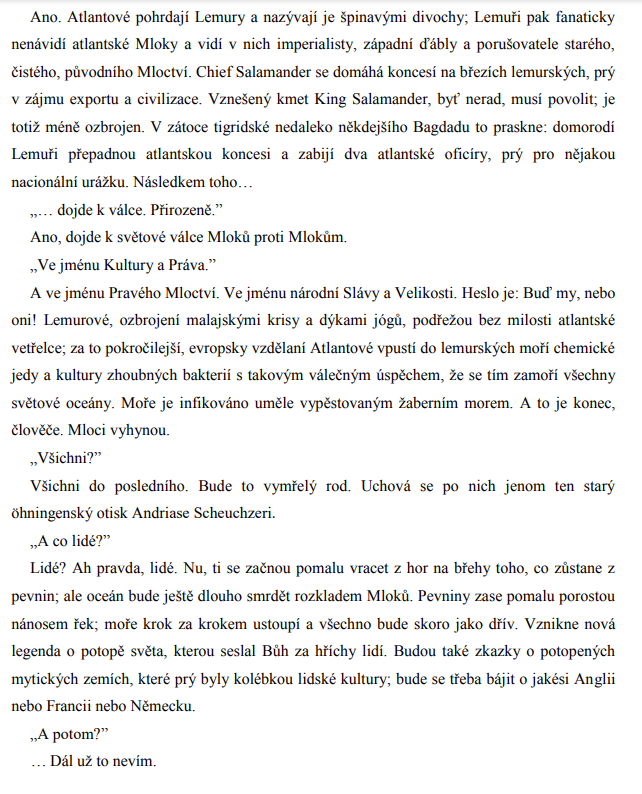

# Kontext
* po 1. sv. válce

## Demokratický proud
* spisovatele dem. proudu spojuje aktivní žurnalistická činnost v Lidových novinách (tisk dem. smýšlející populace)
* „pragmatismus“ = filosofický směr 20. století, který se zrodil v USA (W. James)
  * pro pragmatismus je charakteristický jeho zvláštní pojem pravdy (kritériem pravdy je zkušenost, praxe jednotlivce)
  * Čapek napsal, že pravdivé je pro nás poznání, které se shoduje s naší zkušeností
  * neexistuje žádná absolutní pravda, ale že pojetí pravdy je relativní

* Josef Čapek – Kulhavý poutník
* Ferdinand Peroutka - Budování státu
* Karel Poláček - Bylo nás pět
* Eduard Bass - Cirkus Humberto

## Legionářská literatura
* Rudolf Medek - Anabáze
* Jaroslav Hašek - Osudy dobrého vojáka Švejka za světové války

## Expresionismus
* Richard Weiner - Lítice
* Ladislav Klíma - Utrpení knížete Sternenhocha
* Josef Váchal - Krvavý román

## Imaginativní próza
* Vladislav Vančura - Rozmarné léto, Markéta Lazarová

## Katolická próza
* Jaroslav Durych - Bloudění
* Jakub Deml - Šlépěje

## Próza levicově orientovaných spisovatelů
* Ivan Olbracht - Anna proletářka, Žalář nejtemnější
* Marie Majerová - Siréna
* Marie Pujmanová - Lidé na křižovatce

## Psychologická próza
* Egon Hostovský - Žhář
* Jaroslav Havlíček - Petrolejové lampy, Neviditelný
* Jarmila Glazarová - Vlčí jáma
* Václav Řezáč - Černé světlo

## Německy psaná literatura v Čechách
* Franz Kafka - Proměna, Proces, Zámek
* Meyrink - Golem
* Franz Werfel - Čtyřicet dnů
* Egon Ervín Kisch - Zuřivý reportér

# Autor
* až do konce života redaktorem Lidových novin, časté cesty do ciziny
* zájem o spisovatelovu osobnost byl po 2. sv. válce vyvolán studiemi v zahraničí (v bývalém SSSR) - Čapek se dostal na seznam nevhodných spisovatelů
* Čapek nutí člověka zamýšlet se nad otázkami, jež mají existenciální podtext
* citlivost, moudrost, kultivovanost
* Čapek je demokrat a humanista (nade vše ctí morálku a mravnost)
* „pátečníci“ = přátelé, kteří se scházeli každý pátek v Čapkově vile a probírali spolu politické, kulturní a jiné problémy doby (TGM, F. Peroutka)
* dlouhá souvětí (popisy, přídavná jména, barevnost, hrátky se slovy, slovní hříčky)
* častá synonyma
* hovorová čeština, archaismy
* přehled, hodně informací o problematice, pozorovací talent, intelekt, nadhled
* laskavost ke čtenáři (čtenáře má za partnera – komunikace, oslovení)
* strukturované texty (přehledná, jasná kompozice, postupná a logická argumentace)
* lehké, svěží psaní (i pro složitá témata)
* hlubší myšlenka (psáno pro obyčejné lidi)
* schopnost vyvodit z obyčejných informací obecnější závěr

## Další díla
* Proč nejsem komunistou
* fejetony, sloupky
* Cestovatelské: obrázky z Holandska, Anglické listy
* noetická (poznávací) trilogie - Hordubal, Povětroň, Obyčejný život
* distopie: R.U.R., Věc Makropulos (problematika nesmrtelnosti), Krakatit, Válka s Mloky
* Bílá nemoc, Matka (rozpor mezi mužským a ženským vnímáním světa)

# Ukázka
