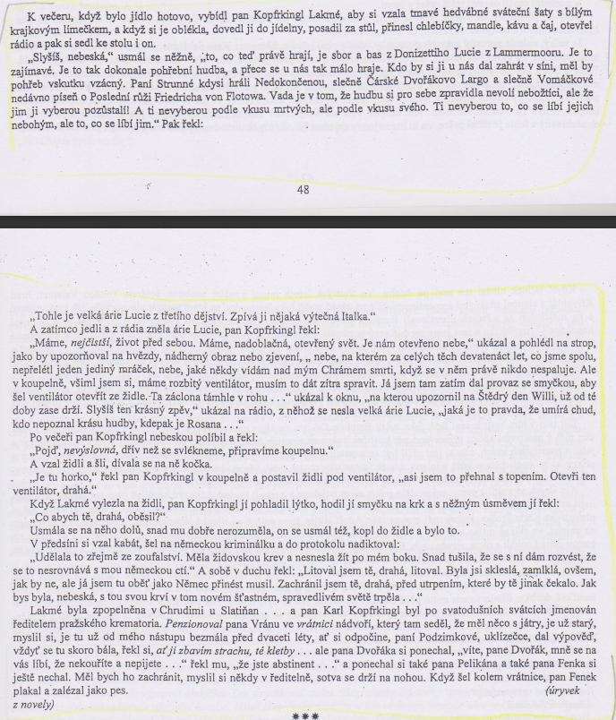

# Kontext
* česká literatura
* 2\. polovina 20. století

## Oficiálně vydávané do 1968
* komunistům nevadily / byly prokomunistické
* Jan Drda - Němá barikáda
* Václav Řezáč - Černé světlo
* Julius Fučík - Reportáže psané na oprátce
* Jan Otčenášek - Občan Brych
  * naboural shecmatickou vlnu

## Oficiálně vydávané po 1968
* Ladislav Fuks - Spalovač mrtvol, Pan Theodor Mundstock
* Ota Pavel - Smrt krásných srnců
* Bohumil Hrabal - Obsluhoval jsem anglického krále, Ostře sledované vlaky
* Václav Kaplický - Kladivo na čarodějnice
* Vladimír Körner - Adelheid, Údolí včel
* Vladimír Páral - Katapult, Milenci a vrazi
* Jarmila Loukotková - Navzdory básník zpívá

## Samizdat a exil
* samizdat z сам издаю nebo самостоятельное издатальство
* Milan Kundera - Nesnesitelná lehkost bytí, Žert, Směšné lásky
* Josef Škvorecký - Zbabělci, Tankový prapor, Prima sezóna (postava Dannyho Smiřického)
* Ladislav Mňačko - Jak chutná noc
* Ludvík Vaculík - Dva tisíce slov
* Artur G. London - Doznání (proces se Slánským)
* Pavel Tigrid - Svědectví

# Autor
* filosofie, psychologie
* píše o psychycky deformovaných lidech
* strach, úzkost, nebezpečí

# Kniha
## Obecně
* román vyšel v době uvolnění režimu
* Změna člověka, pod vlivem historických událostí a nátlaku, od mírumilovného člověka, který má rád svoji rodinu až po vraha, který ji celou zabije, ideologie moci
* zvláštní fyzický kontakt - držení za krk, česání vlasů
* Fuks využívá zvláštních pojmenování - čarokrásná, chrám smrti
* hluboká psychologie
* groteskní motivy
* černý humor
* židovská tématika
* např. smrt manželky - jakoby mimochodem
* precizně promyšlená  stavba a logika příběhu - každé slovo a zmínka má svou příčinu - (A.P. Čechov - když se na jevišti objeví puška, musí se z ní do konce vystřelit)
* často je užívána metoda tzv. opakování motivů - Fuks se vrací k jednomu motivu několikrát, zdánlivě nelogicky - motiv se ukáže býti klíčový = tyč, manželé

### Literární žánr
* próza

### Literární druh
* novela

### Časoprostor
* 1937, Praha

### Kompozice
* chronologicky

### Téma
* posmrtný život
* psychicky deformovaný člověk
* vyřešení židovské otázky (aluze na konci)
* obsese ukončit lidem trápení 

### Motiv
* kovová tyč
* sahání lidem na krk zezadu (=dominance)
* pojmenování (práce, rodina) 

### vypravěč / lyrický subjekt
* er-forma, spisovný jazyk

### typy promluv
* monology, dialogy, přímá i nepřímá řeč

## Postavy

### Karel Kopfrkingl
* nechává si říkat Roman
* nejprve je zásadový, jeho názory se však pod vlivem Willhelma Reinkeho mění
* má německou krev
* nejprve obětavý zaměstnanec krematoria a vzorný otec se postupně mění v udavače a vraha

### Willhelm Reinke
* hrdý Němec
* postupně Karla přesvědčuje, že Němci v Sudetech jsou utlačováni a on jako Němec má povinnost bojovat na jejich straně

### Marie
* Kopfrkingelova žena
* milující, mírná

### Mili
* mladý syn
* zabit svým otcem

### Zina
* dcera
* zachráněna "náhodnými manžely"

# Děj
Příběh se odehrává v Praze v období před okupací a během nacistické okupace. Karel Kopfrkingl pracuje v pražském krematoriu. Svou práci miluje (úplný fanatik). Rozumí si s lidmi, zpočatku je velice ochotný a laskavý. Po práci se věnuje své rodině, kterou má velice rád – navštěvují panoptikum,chodí na procházky, zmrzlinu, Lakmé pořídil obrázky, Zině koupil šaty, s Milim šel na box). Jeho známým je doktor Bettelheim, který je původem Žid (má ordinaci nad nimi, pan Koprfringl k němu pravidelně chodí na kontroly, protože má strach, aby se nenakazil nějakou nemocí, neboť  pracuje s mrtvolami a navštěvuje nevěstince). Pana Kopfrkingla navštěvuje jeho kamarád Willi, který jepříslušníkem NSDAP. Willi je pevným zastáncem nacistické ideologie a snaží se o tom přesvědčit i pana Kopfrkingla. Tvrdí, že říšský pán myslí všechno dobře a špatní jsou Židé. Karel zpočatku tomu nevěří, ale po zabrání Sudet ho Willi zaregistruje jako člena NSDAP a zmanipuluje ho natolik, že si Karel začíná uvědomovat svůj německý původ ,a že jeho manželka je židovka. Pro své členství ve straně musí něco dokázat, proto se pod nátlakem Williho vydává k židovské synagoze převlečený za žebráka. Zde vidí jeho známé, pana doktora Bettelheima, Strausse a Rubensteina . Z pana Kopfrkingla se stane udavač, stoupenec fašistické ideologie, vrah a zrádce. Vše si ospravedlňuje tím, že to dělá pro lidstvo a svým způsobem jim pomáhá.  Pan Kopfrkingl je natolik zfanatizovaný, že svou vlastní ženu oběsí, když jsou sami doma a svede to na sebevraždu.Díky svým „výkonům“ pro říši je Kopfrkingl povýšen na ředitele krematoria. Jelikož teď zastává vysokou říšskou funkci, tak se musí zbavit svých dětí, které nejsou čisté árijské rasy.  Miliho umlátí v krematoriu železnou tyčí a spálí ho v rakvi spolu s mrtvým německým důstojníkem.Celou dobu si myslí, že smrt je jediná a správná cesta, jak je očistit. Zinu se mu zabít nepodaří, protože v  té době už se z něho stává blázen, myslí si, že spasí svět, a že je Budha (ovlivněn knihou o Tibetu, kterou byl doslova fascinován). Po válce je odvezen do  psychiatrické léčebny v Německu.

# Ukázka
* oběšení ženy
