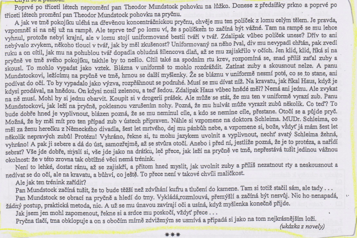

# Kontext
* česká literatura
* 2\. polovina 20. století

## Oficiálně vydávané do 1968
* komunistům nevadily / byly prokomunistické
* Jan Drda - Němá barikáda
* Václav Řezáč - Černé světlo
* Julius Fučík - Reportáže psané na oprátce
* Jan Otčenášek - Občan Brych
  * naboural shecmatickou vlnu

## Oficiálně vydávané po 1968
* Ladislav Fuks - Spalovač mrtvol, Pan Theodor Mundstock
* Ota Pavel - Smrt krásných srnců
* Bohumil Hrabal - Obsluhoval jsem anglického krále, Ostře sledované vlaky
* Václav Kaplický - Kladivo na čarodějnice
* Vladimír Körner - Adelheid, Údolí včel
* Vladimír Páral - Katapult, Milenci a vrazi
* Jarmila Loukotková - Navzdory básník zpívá

## Samizdat a exil
* samizdat z сам издаю nebo самостоятельное издатальство
* Milan Kundera - Nesnesitelná lehkost bytí, Žert, Směšné lásky
* Josef Škvorecký - Zbabělci, Tankový prapor, Prima sezóna (postava Dannyho Smiřického)
* Ladislav Mňačko - Jak chutná noc
* Ludvík Vaculík - Dva tisíce slov
* Artur G. London - Doznání (proces se Slánským)
* Pavel Tigrid - Svědectví

# Autor
* filosofie, psychologie
* píše o psychycky deformovaných lidech
* strach, úzkost, nebezpečí

# Kniha
## Obecně
* některé myšlenky Theodora Mundstocka dosahují až absurdity, někdy si až odporuje
* střídání skutečnosti s fantazií psychicky narušených postav
* složitá metaforičnost a symbolika, která se v díle několikrát navrací a opakuje:
* motiv Kolumbovy plachetnice na otáčivém stínidle lampy
* motiv prachu, dlažby, smetí ulice
* motiv hvězdy, osudu, smrti
* motiv stínu, tmy, šera mlhy
* Nikdy není možné se stoprocentně připravit
* nelidské chování k židům

### Literární žánr
* román

### Literární druh
* psychologická próza

### Časoprostor
* 1941, Praha

### Kompozice
* 2 linie
* tragická, melancholická - do 10. kapitoly, rozštěpené druhé já - stín Mon
* tragikomická, akční - od 10. kapitoly - příprava Mundstocka na koncentrák, bez Mona, končí baladicky

### Téma
* Osudy židů za války, přípravy na koncentrační tábor

### Motiv
* strach, úzkost, židé, koncentrační tábor

### vypravěč / lyrický subjekt
* er-forma, vypravěč v pozadí

### typy promluv
* vnitřní monology 

## Postavy
### Theodor Mundstock
* starý osamělý Žid
* velmi senzibilní
* válkou a čekáním na předvolání do koncentračního tábora psychicky narušený, schizofrenní

### stín Mon
* fiktivní postava - existuje jen v Mundstockově mysli
* Mundstockovo druhé já, představuje racionální složku, je korektorem paniky
* jemu se Mundstock zpovídá ze svých myšlenek, prožitků, obav i představ
* objevuje se u něj po vyhození ze zaměstnání státního bezvýznamného úředníčka a když mu drzý esesák, co ho vyhazoval, vynadal do svobodné židovské svině
* mizí, když nachází trochu vnitřního klidu a naději
* tento zlom přichází v 10. kapitole, od které se začíná systematicky připravovat na transport a pobyt v koncentračním táboře

### kropenatá slepice
* jeho domácí mazlíček, kterému vaří, kvůli které i hladoví, hlavně aby bylo jídlo pro ni, od níž se nechává ozobávat a mazlí se s ní jako se psem nebo kočkou
* najednou slepice mizí a objevuje se zraněný holub, který umírá a Mundstock ho pohřbívá

### rodina Šternů 
* Židé
* manželé, stará matka, dcera Frýda a syn Šimon
* k nim chodí Mundstock na návštěvu a snaží se je vytrhnout z deprese, do které upadli
* vykládá jim karty a obelhává je, že bude líp a že už Němci prohrávají a že jistě nepřijdou do koncentráku

# Děj
Hlavním postavou je bývalý úředník židovského původu pan Theodor Mundstock. Díky svému židovskému původu, se cítí velice nejistý, zranitelný a v neustálém nebezpečí a psychickém napětí. Neustále čeká na předvolání do koncentračního tábora. Žije ve svém útulném bytě s malým tvorečkem, o kterém tvrdí, že je slepice. Později však zjišťujeme, že je to holoubek, Mundstock si to však nepřipouští. To je pro něj charakteristické. Také má své vymyšlené druhá já, kterému říká Mon, přesněji je to jeho vlastní stín. Právě s nimi často komunikuje. V knize se objevují také jeho dobří a dlouholetí přátelé rodina Šternových. Tato rodina se skládá z matky, otce, babičky, syna a dcery. Pan Theodor Mundstock k nim jednou za půl roku dochází a přesvědčuje je, že válka brzy pomine a že jsou v bezpečí. On sám však má opačný názor a je k smrti vyděšený ze současné situace. Z této rodiny má především rád jejich syna Šimona. Velmi mu na něm záleží a vždy v něm viděl slibnou budoucnost. Pan Theodor Mundstock má ještě spoustu známých, o kterých se zmiňuje a přemýšlí nad jejich osudy. Je z této doby velice vyděšen a snaží se být neviditelný. Jednou při údržbě ulice, kterou je pověřen se pro něj vše změní. Uvědomí si, že musí mít vše perfektně zorganizované a promyšlené. Tato chvíle pro něj byla zlomová. Doma ve svém bytě se v myšlenkách přenáší na různá místa a pečlivě se připravuje na situace, které mohou vzniknout v koncentračním táboře a při cestě do něj. Snaží se na vše připravit a vše si prožít aby nebyl zaskočen. Zbaví se strachu a je hrdý na svůj původ. Po uplynutí nějaké doby je většina jeho přátel odvezena do táborů. Jednoho večera Theodor Mundstock provádí jeho poslední zkoušku, při které málem příjde o život. V tom do jeho bytu vtrhne gestapo, obrátí mu to tam naruby a má spoustu vulgárních připomínek na jeho osobu. Zanedlouho mu příjde dlouho očekávaná pošta. Není však zdrcen ale hrdě tomu čelí s tím, že je připraven na vše. Nakonec dojde i na rodinu Šternových. Žena mu však píše dopis že, Šimon zůstává doma a bude odvezen až dalším vlakem. Theodor se rozhodne, že ho zachrání a předá mu všechny svoje poznatky důležité pro přežití v koncentračním táboře. Má na to tři dny. Spolu se Šimonem pak mají odjíždět do tábora. Na nádraží se však stane nešťastná událost a pak Mundstock je přejet vojenským autem a umírá. Jeho poslední slova byli Mone, na které zareagoval právě Šimon jako na své jméno.

# Ukázka
* začal trénovat na koncentrák

