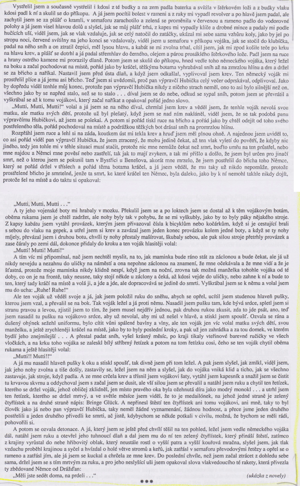

# Kontext
* česká literatura
* 2\. polovina 20. století

## Oficiálně vydávané do 1968
* komunistům nevadily / byly prokomunistické
* Jan Drda - Němá barikáda
* Václav Řezáč - Černé světlo
* Julius Fučík - Reportáže psané na oprátce
* Jan Otčenášek - Občan Brych
  * naboural shecmatickou vlnu

## Oficiálně vydávané po 1968
* Ladislav Fuks - Spalovač mrtvol, Pan Theodor Mundstock
* Ota Pavel - Smrt krásných srnců
* Bohumil Hrabal - Obsluhoval jsem anglického krále, Ostře sledované vlaky
* Václav Kaplický - Kladivo na čarodějnice
* Vladimír Körner - Adelheid, Údolí včel
* Vladimír Páral - Katapult, Milenci a vrazi
* Jarmila Loukotková - Navzdory básník zpívá

## Samizdat a exil
* samizdat z сам издаю nebo самостоятельное издатальство
* Milan Kundera - Nesnesitelná lehkost bytí, Žert, Směšné lásky
* Josef Škvorecký - Zbabělci, Tankový prapor, Prima sezóna (postava Dannyho Smiřického)
* Ladislav Mňačko - Jak chutná noc
* Ludvík Vaculík - Dva tisíce slov
* Artur G. London - Doznání (proces se Slánským)
* Pavel Tigrid - Svědectví

# Autor
* Nymburk, otec řiditel pivovar
* všechny možný zaměstnání
* pábitelé
* smrt náhoda / sebevražda
* většina děl nemá souvislý děj
* perlička na dně - v kařdém je kus dobra
* chrlení
* erotika, černý humor

* žil v Nymburku, jeho otec ředitelem pivovaru, vystudoval právnickou fakultu UK
* vystřídal pestrou mozaiku zaměstnání - výpravčí, dělník v kladenských ocelárnách, balič starého papíru => inspirace pro psaní, velká autobiografičnost
* zemřel nešťastnou náhodou/sebevražda?
* osobité vidění světa (posedlost životem) - poetika (s láskou, porozuměním, pochopení, ve všedním životě krása)
* většina děl je bezsyžetová (=nemají souvislý děj) kromě 2 
* texty jsou plynulým tokem jednotlivých, zdánlivě nesouvisejících příběhů - metoda koláže nebo automatického záznamu (vliv surrealismu a dadaismu)
* kontrasty (krása a ošklivost)
* zájem o lidi z periferie
* erotika, černý humor a groteskní scény
* výborný postřeh, vztah k zemi bez patetičnosti
* hovorový, trefný a někdy drsný jazyk, vyhýbá se přesnější a podrobnější psychologické próze
* mnohé knihy vyšly nejprve v exilu a až poté u nás
* musel se rozhodnout zda knihu vydat nebo lpět na původním textu a knihu nevydat vůbec 
* další díla:
* Perlička na dně – soubor povídek
* Pábitelé
* Taneční hodiny pro starší a pokročilé – celý text je jedna dlouhá věta, ovlivněn moderní prózou vrcholné období – 70. léta: 
* tzv. nymburská trilogie = Městečko u vody = Městečko, kde se zastavil čas: 
* Postřižiny, Krasosmutnění, Harlekýnovy milióny
* spojující postavou je strýc Pepin, který přijel na 14 dní a zůstal několik let
* vypravěčkou je Hrabalova maminka – paní sládková
* Obsluhoval jsem anglického krále – hlavní hrdina Jan Dítě je malého vzrůstu, vnucuje se do vyšších vrstev
* Slavnosti sněženek – soubor povídek o obyvatelích chatové oblasti Kersko
* Příliš hlučná samota – monolog baliče sběrového papíru Haňti, vzděláván proti své vůli				
* téměř všechna díla zfilmoval Menzel (za Vlaky Oscar - nejlepší cizojazyčný film) knihy přeloženy do 28 jazyků
* přijetí: někteří milovali, ale mnozí konzervativci vyčítali knize vulgaritu, obscénnost a sexuální motivy 

# Kniha
## Obecně
* metoda koláže (srovnání se s psychickým traumatem a atentát na muniční vlak)
* autobiografické rysy (zaměstnání) 
* postavy poznáváme na základě jejich jednání, nikoli explicitní psychologie
* Válka -> není líčena bezprostředně, spíše se o ní dozvídáme zprostředkovaně, do osudů zasáhne až nakonec
* Surrealismus -> například obrazy mrtvých koní, některá vyprávění postav
* Erotika, falické symboly -> samotný intimní problém, krmení husy, scéna z ateliéru
* Humor -> název ateliéru „Za 5 minut hotové“, milostné scény
* Motiv sebevraždy ->pro Hrabala fascinující téma, předobrazem novely je především existenciální povídka Kain (1949) – zde vliv Kafky, Goetha apod.
* Pábitelské povahy (například výpravčí Hubička)
* Jména postav jsou symbolická (Hrma, Hubička, Svatá, Viktoria Freie)
* Postavy => obyčejní lidé 
* Kontrasty -> intimní vztah x drsné obrazy, krutost x něha, láska x válka,
* hrabalovské nazírání na svět, s láskou, pochopením, určitě s porozuměním, mistrovská schopnost najít ve všedním životě krásu, dramatičnost apod.
* Text působí jako celek přirozeně, spontánně
* jazyk: hovorový, je protkán místy obrazným pojmenováním (drsnost metafor), typický Hrabal – expresivita, drsné obrazy v poetických chvílích, dlouhá souvětí, vulgarita ve vypjatých scénách

### Literární žánr
* novela

### Literární druh
* próza, epika

### Časoprostor
* železniční stanice, rok 1945

### Kompozice
* chronologicky

### Téma
* kritika fašismu a války

### Motiv
* sebevražda
* poetika
* železniční prostředí
* erotika
* intimní problémy
* vztah k zemi
* krmení husy
* pábitelství

### vypravěč / lyrický subjekt
* ich-forma (hl. postava) 

### vyprávěcí způsoby
* monology 

### typy promluv
* dialogy, přímá i nepřímá řeč

## Postavy
### Miloš Hrma
* 22letý začínající výpravčí
* čestný a spravedlivý
* bojuje s pocitem, že není "opravdový chlap"

### výpravčí Hubička
* má velmi rád ženy
* nebojácný, chytrý
* nemá rád Němce

### přednosta stanice
* ctižádostivý
* má rád své holuby
* ve své podstatě je hodný

### výpravčí Máša
* chodila s Milošem

### Zdenička Svatá
* telegrafistka, které pan Hubička orazítkuje zadnici

### partyzánka Viktoria Freie
* dodá Hubičkovi bombu a zbavuje ho jeho "problému", poté odjíždí do Kerska

# Děj
Miloš se po třech měsících vrací zpět do práce (pracuje na železniční stanici Kostomlaty a je elévem dopravy - začátečník). Přitom vzpomíná na svou rodinu a svůj dosavadní život. Dříve bydleli za městem, ale přestěhovali se do města, cítí se tam sklíčeně, pozorovaně. Jeho tatínek byl od 48 let v penzi, byl strojvedoucím od svých 20 let a když měl vyslouženo a byl v penzi, všichni ho za to nenáviděli (záviděli mu). Jeho dědeček byl hypnotizér v cirkusech. Vzdoroval Němcům tak, že se postavil před tanky a pokusil se je zhypnotizovat. Němci ho přejeli a skřípli mu hlavu mezi pásy tanku. A jeho pradědeček bral od 18 let rentu, zlatku denně. Byl vojenským tamborem, kterého zranili studenti, dostal kamenem do kolena a za to dostával rentu. Smál se ostatním pracujícím a ti ho jednou zbili tak, že umřel. Mezitím Miloš poodhaluje svůj život a co prožil. Vzpomíná jak "zvadl", když leželi s Mášou pod plachtou a jak si pak podřezal žíly. Mezitím se dozvídá, že výpravčí Hubička orazítkoval zadek Zdeničce Svaté. Nejdříve jím opovrhuje (tak jako všichni ostatní), poté ale mění názor a ostatní mu dokonce závidí (sami by chtěli něco takového udělat, ale nemají na to dostatek odvahy). Miloš se zatím stále trápí se svým pocitem, že není "chlap". Hledá pomoc (ptá se i zkušeného Hubičky). Trápí se kvůli svému problému s erekcí (v knize použit latinský výraz eiaculatio praecox). Kvůli tomu si podřezal žíly.
Hlavní částí knihy je, že Hubička navrhne Milošovi, že vyhodí ostře sledovaný vlak (vlak s municí na cestě do Německa). Řekne o tom Milošovi, ten s tím souhlasí a nakonec to i sám provede. Výbušninu mu přiváží Viktoria Freie k zlikvidování vlaků a zároveň likviduje i Milošův problém s panictvím a erekcí. Příběh končí tak, že Miloš a německý voják leží na zemi a umírají (vzájemně se postřelili). V tu chvíli si Miloš uvědomil, jak je válka zbytečná a že tu teď oba i zbytečně zemřou. A ještě než Miloš umírá, slyší, jak vlak vybouchne.

# Ukázka
* konec

