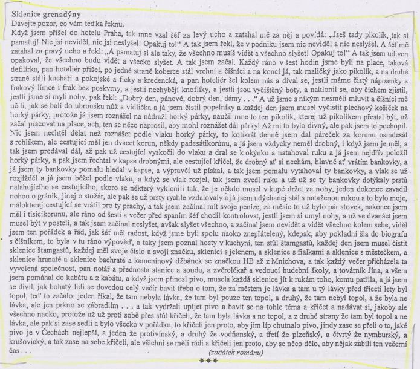

# Kontext
* česká literatura
* 2\. polovina 20. století

## Oficiálně vydávané do 1968
* komunistům nevadily / byly prokomunistické
* Jan Drda - Němá barikáda
* Václav Řezáč - Černé světlo
* Julius Fučík - Reportáže psané na oprátce
* Jan Otčenášek - Občan Brych
  * naboural shecmatickou vlnu

## Oficiálně vydávané po 1968
* Ladislav Fuks - Spalovač mrtvol, Pan Theodor Mundstock
* Ota Pavel - Smrt krásných srnců
* Bohumil Hrabal - Obsluhoval jsem anglického krále, Ostře sledované vlaky
* Václav Kaplický - Kladivo na čarodějnice
* Vladimír Körner - Adelheid, Údolí včel
* Vladimír Páral - Katapult, Milenci a vrazi
* Jarmila Loukotková - Navzdory básník zpívá

## Samizdat a exil
* samizdat z сам издаю nebo самостоятельное издатальство
* Milan Kundera - Nesnesitelná lehkost bytí, Žert, Směšné lásky
* Josef Škvorecký - Zbabělci, Tankový prapor, Prima sezóna (postava Dannyho Smiřického)
* Ladislav Mňačko - Jak chutná noc
* Ludvík Vaculík - Dva tisíce slov
* Artur G. London - Doznání (proces se Slánským)
* Pavel Tigrid - Svědectví

# Autor
* Nymburk, otec řiditel pivovar
* všechny možný zaměstnání
* pábitelé
* smrt náhoda / sebevražda
* většina děl nemá souvislý děj
* perlička na dně - v kařdém je kus dobra
* chrlení
* erotika, černý humor

* žil v Nymburku, jeho otec ředitelem pivovaru, vystudoval právnickou fakultu UK
* vystřídal pestrou mozaiku zaměstnání - výpravčí, dělník v kladenských ocelárnách, balič starého papíru => inspirace pro psaní, velká autobiografičnost
* zemřel nešťastnou náhodou/sebevražda?
* osobité vidění světa (posedlost životem) - poetika (s láskou, porozuměním, pochopení, ve všedním životě krása)
* většina děl je bezsyžetová (=nemají souvislý děj) kromě 2 
* texty jsou plynulým tokem jednotlivých, zdánlivě nesouvisejících příběhů - metoda koláže nebo automatického záznamu (vliv surrealismu a dadaismu)
* kontrasty (krása a ošklivost)
* zájem o lidi z periferie
* erotika, černý humor a groteskní scény
* výborný postřeh, vztah k zemi bez patetičnosti
* hovorový, trefný a někdy drsný jazyk, vyhýbá se přesnější a podrobnější psychologické próze
* mnohé knihy vyšly nejprve v exilu a až poté u nás
* musel se rozhodnout zda knihu vydat nebo lpět na původním textu a knihu nevydat vůbec 
* další díla:
* Perlička na dně – soubor povídek
* Pábitelé
* Taneční hodiny pro starší a pokročilé – celý text je jedna dlouhá věta, ovlivněn moderní prózou vrcholné období – 70. léta: 
* tzv. nymburská trilogie = Městečko u vody = Městečko, kde se zastavil čas: 
* Postřižiny, Krasosmutnění, Harlekýnovy milióny
* spojující postavou je strýc Pepin, který přijel na 14 dní a zůstal několik let
* vypravěčkou je Hrabalova maminka – paní sládková
* Obsluhoval jsem anglického krále – hlavní hrdina Jan Dítě je malého vzrůstu, vnucuje se do vyšších vrstev
* Slavnosti sněženek – soubor povídek o obyvatelích chatové oblasti Kersko
* Příliš hlučná samota – monolog baliče sběrového papíru Haňti, vzděláván proti své vůli				
* téměř všechna díla zfilmoval Menzel (za Vlaky Oscar - nejlepší cizojazyčný film) knihy přeloženy do 28 jazyků
* přijetí: někteří milovali, ale mnozí konzervativci vyčítali knize vulgaritu, obscénnost a sexuální motivy

# Kniha
## Obecně

# Děj

Vypravěčem je Jan Dítě, který má komplexy ze své výšky, ale snaží se za každou cenu stát úspěšným. Začíná pracovat na dráze jako prodavač párku, později se stane pikolíkem v hotelu Zlatá Praha. Pak se dostane do hotelu Paříž, kde obdivuje svého nadřízeného vrchního Skřivánka. Sázejí se spolu, jaký host si dá, jaké jídlo. Skřivánek vždy vyhraje. Dítě se mi ho zeptá, jak to všechno ví a Skřivánek mu odpoví: „ Obsluhoval jsem anglického krále.“ Janovi se poštěstí, že obsluhuje habešského císaře a dostane za to řád habešského císaře. Dostane ho však náhodou, protože císař je malý a dosáhne jen na Dítě. Jan je z hotelu propuštěn, protože se zamiluje do Němky Lízy. Během války jsou s Lízou velkými příznivci nacistické strany. Vezmou se a mají spolu syna, který je lehce postižený. Jediné, co ho baví je mlácení kladivem. Líza má sbírku známek, které jsou velmi cenné. Líza umírá během náletů na konci války. Jan si bere její známky, prodává je a kupuje si za ně hotel. Jeho hotel je nejlepší hotel v Čechách a také nejvíce zajímavý. Janovi je ale zabaven a on je poslán do vězení pro milionáře. On se tam ale chtěl dostat, přímo po tom toužil, konečně byl mezi milionáři. Po propuštění z vězení je zaměstnán na Šumavě jako opravář cest, on zde však konečně nachází svůj klid a dožívá zde.

# Ukázka
* začátek

