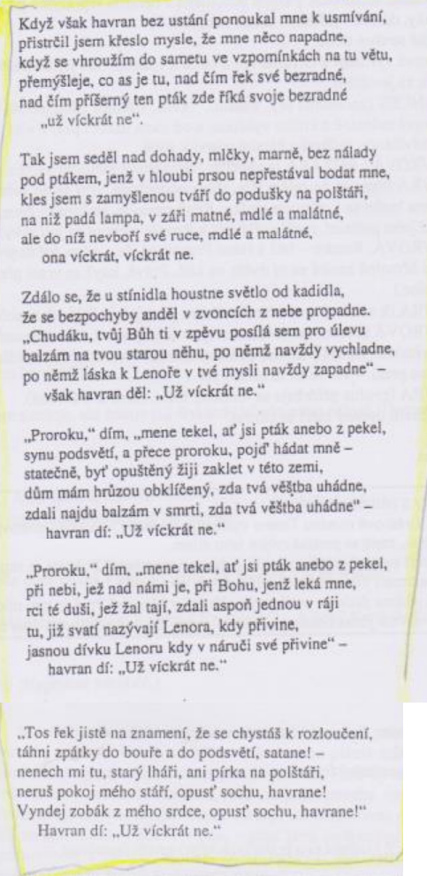

# Kontext
* konec 19. století
* žil ale na začátku

## Dekadence
* životní pocit × symbolismus (směr)
* pocit umělců, znechucení společností, utíkají od ní a vytvářejí si vlastní svět
* v literatuře pesimistické nálady, modribita, pocit zmaru, erotická přesycenost, mysticismus, narcismus
* bohémství, satanismus, nevázaný sex, alkohol, tuláctví, výstřednost
* většinou i symbolisté
* ovlivnili směry počátku 20. století
* uvolnění literatury po stánce etické i z hlediska formy
* lartpourlartismus
  * umění pro umění
  * klade důraz na formální stránku umění

## Dekadenti
* Oscar Wilde - Obraz Doriana Graye, Jak je důležité míti Filipa, Střašidlo Cantervillské
* Walter Whitman - Stébla trávy

## Prokletí básníci
* dekadentní básníci ve Francii
* Charles Baudelaire - Květy zla, Mršina
* Paul Verlain - Láska
* Artur Rimbaud - Opilý koráb, Samohlásky

## Česká moderna

## Generace buřičů
* Petr Bezruč - Slezské písně (Maryčka Magdónova, Ostrava, Ošklivý zjev)
* František Gellner - Po nás ať přijde potopa, Radosti života
* Fráňa Šrámek - Života bído, přec tě mám rád, Splav, Stříbrný vítr, Měsíc nad řekou
* Stanislav Kostka Neumann - Rudé zpěvy

# Autor
* lartpourlartismus
* časově ještě romantik, ale jinak symbolista
* Američan
* literatura hrůzy
* racionální přístup k tvorbě textu
* nejdřív efekt, pak děj a text
* postava racionálního detektiva (Dupin) - inspirace pro Sherlocka Holmese

# Kniha
## Obecně
* velmi jednoduchá, ale záhadná báseň
* inspirace lidovou baladou
* celá sbírka Havran a jiné básně obsahuje celkem 29 básní
* tímto dílem vnesl Poe nejen do americké poezie principy tajemnosti, hrůzostrašnosti a fantastičnosti
* dílo je velice rafinované, bylo vybudováno na zcela racionálním základě
* Poe z hlediska časového romantický autor, tak zde se již programově pracuje se symbolem - vševládné smrti (princip konotace)
* pravý smysl Havrana je odkrýván postupně, ke konci se stává satanem, ďáblem (navždy uhranul duši muže, která se již nikdy nevzchopí), ovlivnění prokletým básníkem Baudelairem
* muž ví, že Havran umí jen a pouze onen refrén, a přesto dál klade otázky - sebetrýzeň, bolest
* jedná se o nejpřekládanější autorovu báseň (jen u nás kolem 20 překladů)
* atmosféra - pocity samoty, smutku, melancholie, zmaru, tajemnosti a hrůzy (prostředí - přítmí, zešeřelost)
* báseň je vystavěna na půlnočním (symbol tajemnosti, hodina duchů) dialogu zoufalého a truchlícího muže se zlověstným havranem
* Mene tekel = označení naléhavého varování před bezprostředně hrozící pohromou
* gradace napětí
* kontrasty - láska a smrt
* opakování refrénu - v češtině nejlepší překlad od Nezvala - „už víckrát ne“ (zachován zvukový dojem - kakofonie)
* pro tuto báseň je velice důležitá esej Filozofie básnické skladby, kde Poe obecně konstatuje, že v poezii se má dopředu naplánovat účinek básně a racionálně postupovat při jejím psaní
* Poe je vlastně typickým představitelem lartpourlartismu (zformulovány jeho estetické názory)

### Literární žánr
* balada (pochmurný děj a neperspektivní, tragický, závěr)

### Literární druh
* lyricko-epická báseň 

### Časoprostor
* báseň se odehrává v pokoji lyrického subjektu v zimní večer

### Kompozice
* členěno na 18 šestiveršových slok - trochej (chronologický postup)

### Téma
* básníkův smutek a touha po zesnulé milé Lenoře

### Motiv
* posmrtný život
* nekonečná touha
* sebetrýzeň
* konflikt mezi touhou zapomenout a touhou zapamatovat si
* prolínání smrti a lásky

### vypravěč / lyrický subjekt
* ich-forma (neznámý muž, personální vypravěč)

### vyprávěcí způsoby
* přímá, nepřímá řeč

### typy promluv
* časté monology, dialogy

### veršová výstavba
* trochej, volný verš (typický pro romantismus)

# Děj
Báseň je psána v ich-formě, lyrickým subjektem (= vypravěčem) je osamělý muž trýzněný horečkou a především mučivými vzpomínkami na zemřelou dívku Lenoru, k níž marně hledá cestu čtením v okultních svazcích. Lyrický subjekt vystraší o půlnoci šramot. Ukáže se, že původcem podivných zvuků je krkavec (v tradičních českých, ale i mnoha jiných cizojazyčných, překladech básně označovaný jako havran, zoologicky sice nesprávně, ale ve shodě s tradiční literární symbolikou české poezie), který vzápětí vletí do jeho pokoje a znepokojuje muže svou záhadností. Na všechny otázky, zpočátku míněné žertem, přitom odpovídá jedním slovem – nevermore (do češtiny překládáno většinou jako víckrát ne nebo nikdy víc, občas ponecháváno v originále. Zásadně odlišných překladatelských řešení tohoto refrénu není mnoho). Mužův neklid se stupňuje v paniku a posléze v hrůzu. Snaží se krkavce vyhnat, ten ale zůstává na svém místě. V závěru lyrický subjekt metaforicky konstatuje, že krkavec už nikdy neodletí z jeho duše.

# Ukázka
