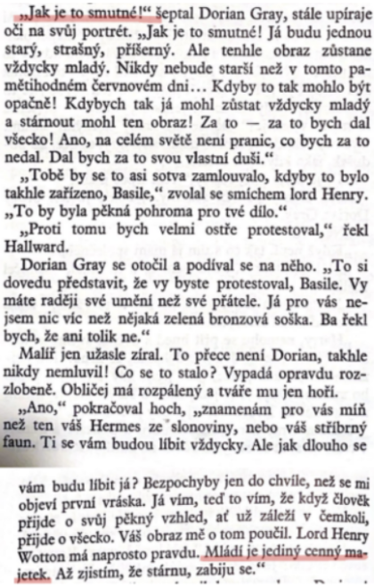

# Kontext
* konec 19. století

## Dekadence
* životní pocit × symbolismus (směr)
* pocit umělců, znechucení společností, utíkají od ní a vytvářejí si vlastní svět
* v literatuře pesimistické nálady, modribita, pocit zmaru, erotická přesycenost, mysticismus, narcismus
* bohémství, satanismus, nevázaný sex, alkohol, tuláctví, výstřednost
* většinou i symbolisté
* ovlivnili směry počátku 20. století
* uvolnění literatury po stánce etické i z hlediska formy
* lartpourlartismus
  * umění pro umění
  * klade důraz na formální stránku umění

## Dekadenti
* Allan Edgar Poe - Jáma a kyvadlo, Havran
* Walter Whitman - Stébla trávy

## Prokletí básníci
* dekadentní básníci ve Francii
* Charles Baudelaire - Květy zla, Mršina
* Paul Verlain - Láska
* Artur Rimbaud - Opilý koráb, Samohlásky

## Česká moderna

## Generace buřičů
* Petr Bezruč - Slezské písně (Maryčka Magdónova, Ostrava, Ošklivý zjev)
* František Gellner - Po nás ať přijde potopa, Radosti života
* Fráňa Šrámek - Života bído, přec tě mám rád, Splav, Stříbrný vítr, Měsíc nad řekou
* Stanislav Kostka Neumann - Rudé zpěvy

# Autor
* Ir
* dekadence, lartpourlartismus
* intelekt, ironie, vtip -> oblíbený společní
* obviněn z homosexuality, lidé se obrátili proti němu
* není nic takového, jako morální nebo nemorální kniha, buď je dobře napsaná, nebo špatně, nic jinýho

# Kniha
## Obecně
* aforismy, paradoxy, filosofie
* dialogy
* dramatičnost
* popisy přírody, karikované postavy anglické smetánky
* morálka
* po vydání nebyla dobře přijata - nestoudnost, morbidnost
* soud -> obvinění z homosexuality
* mládí je cenný majetek
* kontrast: vnější krása × morálka
* námět proměny z Jekyll and Hyde

## Postavy
### Dorian Gray
* neobyčejně krásný nezkušený mladík
* zamiluje se do své krásy
* z mravně čistého se stává zvrhlík

### Basil Hallward
* malíř
* Dorianův přítel
* hodný
* zajímá se o Dorianův osud

### Lord Henry (“Harry”) Wotton
* ponouká Doriana ke zlu
* rád filozofuje
* panovačný a sobecký

### Sibyla Vaneová
* mladá
* krásná
* labilní
* přecitlivělá
* začínající herečka
* zamilovala se do Doriana (miluje ho víc než on ji, až mu začne být na obtíž)
* neunesla Dorianovu kritiku (spáchala sebevraždu)

### James Vane
* Sibylin bratr
* slíbil vraždu tomu, kdo Sibyle ublíží
* když natrefil na Doriana, prvně ho nepoznal
* později byl omylem zabit při lovu

# Děj
Dorian a jeho obraz jsou propojeni, protože Dorian si přál zůstat stále mladý a krásný. Jeho duše přešla do obrazu a do obrazu se vykresluje vše, co Dorian zažívá – stárnutí a hříchy.
Malíř Basil Hallward nakreslil obraz mladého a krásného Doriana Graye. Obraz je to nejlepší, co kdy Basil namaloval. Během tvorby obrazu se Dorian seznámí s Henry Wottonem, který Doriana začne obdivovat pro jeho krásu, ale nezapomene dodat, že krása je pomíjivá. Dorian se stárnutí obává, a tak vysloví přání, aby nestárnul on, ale dokončovaný obraz. Přání se plní, Dorian zůstává stále mladý, stárne pouze obraz, který má Dorian uschovaný v jednom z pokojů svého domu. Velká změna nastane na obraze ve chvíli, kdy se kvůli Dorianovi zabije mladá krásná herečka Sibyla. Dorian jí totiž bez obalu řekl, že její herecký výkon byl otřesný a on ji již nemiluje.Basil po letech toužil svůj obraz znovu vidět, ale jeho proměny se zděsil. Je jediným svědkem změny obrazu, proto se Dorian rozhodne, že musí Basila zabít. Dorian vydírá jistého Campbella, který dokáže Basilovu mrtvolu rozpustit speciální látkou.
Dorian se občas trápí výčitkami, vždy však převáží jeho špatná stránka. Je stále sobecký a na ostatních si vybíjí svou zlobu. Sibylin bratr James se chce Dorianovi pomstít, ale ani v tomto případě není Dorian potrestán. James je omylem zabit při lovu, jehož se Dorian účastnil. Od této chvíle je Dorian nervózní a plný strachu, pochopí, že za své skutky bude velmi brzy pykat.  V největším návalu vzteku a smutku probodne nožem obraz, na kterém je v tuto chvíli odporný stařec a krvavýma rukama. Zabije tak však sám sebe, padá k zemi mrtev. V tu chvíli se obraz znovu proměňuje, je na něm mladý a krásný Dorian. Služebnictvo, které mrtvolu objevilo, poznalo svého pána jen kvůli šperkům.

# Ukázka
