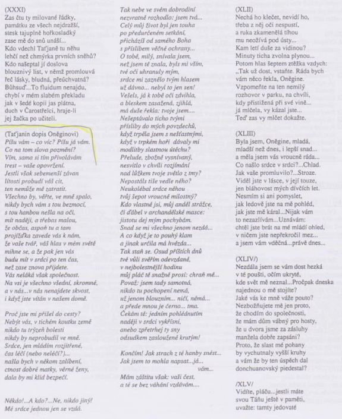

# Kontext
* 18\./19. století

## Romantismus
* umělecký a životní styl
* reakce proti racionalitě klasicismu
* vznik v Anglii
* inspirace v gotice
* v ošklivosti je krása
* rozpor mezi snem a skutečností
* výjimenčná, tajmená prostředí

## Anglie
* George Gordon Byron - Childe Haroldova pouť
* Percy Bysshe Shelley - Odpoutaný Prométheus
* Walter Scott - Ivanhoe, Waverly

## Francie
* Victor Hugo - Chrám matky Boží v Paříži, Bídníci, Legenda věků
* Stendhal - Červený a černý, Kartouza parmská

## Německo
* Novalis - Hymny nocí
* E. T. A. Hoffmann - Životní názory kocoura Moura
* bratři Grimmové - pohádky

## Rusko
* Alexandr Sergejevič Puškin - Evžen Oněgin, Piková dáma, Cikáni
* Michail Jurjevič Lermontov - Démon
* Ivan Alexandrovič Gončarov - Oblomov

## Polsko
* Adam Mickiewicz - Pan Tadeáš

## Čechy
* Karel Jaromír Erben - Kytice
* Karel Hynek Mácha - Máj, Cikáni, Večer na Bezdězu, Křivoklát
* Josef Kajetán Tyl - Fidlovačka aneb žádný hněv a žádná rvačka, Kutnohorští havíři, Strakonický dudák
* Karel Sabina - libreta (texty) ke Smetanově opeře Prodaná nevěsta

# Autor
* pocházel ze starého šlechtického rodu
* politicky angažovaný
* vyhnanaství
* byl zabit v souboji s milencem své ženy

# Kniha
### Druh a žánr
* Epický román ve verších = poema
* též byronská povídka
  * George Gordon Byron, Walter Scott
  * lyricko-epická veršovaná skladba s roztříštěnou kompozicí
  * děj je potlačen na úkor líčení pocitů
  * dojmů
  * často autobiografické
  * milostné motivy

### Časoprostor
* Počátek 19. století na ruském venkově

### Kompozice
* 8 hlav + úryvky z Oněginovy cesty po Rusku
* Princip zrcadlové kompozice
  * velké množství kontrastů
  * město x vesnice
  * Oněgin x Lenskij
  * Olga x Tatiana
  * prvky realismu (kritika společnosti) x prvky romantismu

### Vypravěč
* Er-forma
  * vypravěč vypráví děj, ale občas se od něj distancuje = dva Puškinové 
* Ich-forma
  * dopisy, viz ukázka

### Jazyk
* Verš - oněginská sloka = 14 veršů po 8-9 slabikách, užíván jamb
* Často cizí slova  - francouzština, vliv Evropy, v Rusku hodně

### Téma a motiv
* Nadčasové téma nenaplněné lásky Evžena a Taťány
* odehrávající se na pozadí rozporuplného prostředí ruské společenské smetánky 19. století
* Znechucení zbytečností
* problémy lásky
* pohrdání společností, které je důsledkem Oněginovy ztracenosti
* jeho vysoká očekávání
* Téma lidské osamělosti
* Příběh člověka, jenž je obětí sebe sama
* Velkou roli hrají také kontrasty města a venkova - povrchní měšťané x laskaví vesničané

#### Konflikt
* Jedinečnost vs. uniformita
* Ideály vs. rezignace
* Konflikt se světem
* Bouří se proti společnosti
* Láska vs. samota

## Postavy
### Evžen Oněgin
- hlavní hrdina
- petrohradský švihák
- typická romantická postava, která touží po nedosažitelném
- je vzdělaný, avšak lehkovážný
- postupně ztrácí smysl života
- je znuděný
- symbol zbytečného člověka

### Lenskij
* opak Evžena
* neúspěšný básník
* nepraktický a naivní člověk
* romantik

# Děj
Evžen Oněgin je mladý lev salónů, žijící v Moskvě ale po čase večírků a ruské smetánky, je znuděn tímto životem a když onemocní jeho strýc, žijící na venkově rád uvítá cestu za ním a následně přebírá jeho dům. Zde se seznámí s budoucím přítelem Lenskym se kterým následně tráví mnoho času, avšak dvě sestra Olga a Taťána mezi ně vnesou svár a vede to až k duelu, kde je Lenskyj zabit. Oněgin následně utíká apo letech se však vrací, a potkává Taťánu, které nejdříve neopětoval lásku, ale nyní ji chce, ale ona je už vdaná.

# Ukázka
