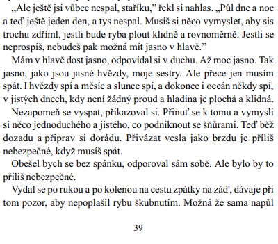
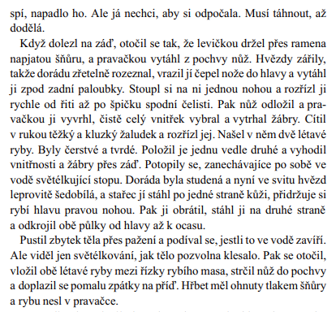
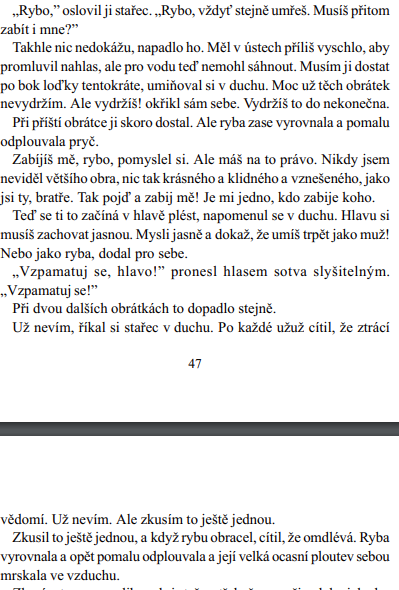

# Kontext
* světovka mezi válkami

## Ztracená generace
* generační skupina amerických autorů, kteří byli poznamenáni duchovním otřesem 1. sv. války a kteří zároveň vystřízlivěli z “Amerického snu” 
* základním literárním tématem je zklamání a skepse
* rozklad tradičních lidských a společenských hodnot (válka vše zdeformovala)
* hrdinové se uzavírají, jsou apatičtí, nejsou schopni navázat na dřívější vztahy
* hlavní hrdinové jsou “ztracení” jednotlivci, již nenacházejí nikde zakotvení
* citová vyprahlost

ztracená generace (americká próza):
William Faulkner - Divoké palmy
Francis Scott Fitzgerald - Velký Gatsby
John Steinbeck - O myších a lidech, Na východ od ráje
Henry Miller - Obratník Raka
experimentální próza:
Marcel Proust - Hledání ztraceného času
James Joyce - Plačky nad Finneganem, Odysseus
Franz Kafka - Proměna, Proces, Zámek (i německy psaná. lit.)
francouzská próza: 
Anatole France - Ostrov tučňáků 
Henry Barbusse - Oheň
Antoine de Saint-Exupéry - Malý princ
Romain Rolland - Petr a Lucie

## německy psaná literatura
* Erich Maria Remarque - Na západní frontě klid, Tři kamarádi
* Heinrich Mann - Profesor Neřád
* Lion Feuchtwanger - Židovka z Toleda, Židovská válka
* Hermann Hesse - Stepní vlk

### německy psaná lit. v českých zemích
* Meyrink - Golem
* Franz Werfel - Čtyřicet dnů
* Egon Ervín Kisch - Zuřivý reportér

### anglicky psaná literatura
* George Bernard Shaw - Pygmalion 

### ~~česky psaná literatura~~
* ~~Vítězslav Nezval - Edison, Žena v množném čísle~~
* ~~Jaroslav Hašek - Osudy dobrého vojáka Švejka za světové války, Můj obchod se psy~~
* ~~Ladislav Klíma - Utrpení knížete Sternenhocha~~
* ~~Karel Čapek - R.U.R., Věc Makropulos, Bílá nemoc, Krakatit, Válka s mloky, Matka,...~~
* ~~Karel Poláček - Bylo nás pět, Muži v ofsajdu~~
* ~~Eduard Bass - Klapzubova jedenáctka, Cirkus Humberto~~
* ~~Vladislav Vančura - Rozmarné léto, Markéta Lazarová~~
* ~~Ivan Olbracht - Žalář nejtemnější~~
* ~~Jaroslav Havlíček - Petrolejové lampy, Neviditelný~~

# Autor
* američan
* dopisovatel v WW1 a španělské občanské válce
* po 2. sv válce na Kubě
* metoda ledovce
* psychologie člověka
* fascinace mezními situacemi
* ztracenost a vykořeněnost

# Kniha
## Obecně
* velice stručný, úsporný a prostý děj (formální stránka je upozaděna, drama zápasu je ve středu pozornosti)
* žádné složité prolínání časových rovin, žádné experimentování s formou (vše chronologicky členěné)
* metoda ledovce = destilace skutečnosti
  * spočívá v tom že v díle autor eliminuje vše nepodstatné a soustředí se především na hlavní myšlenku celého příběhu.
* hlavní hrdina je typický pro autora (oslava síly, statečnost, vzepětí, schopnosti sám sebe překonat, stařec žije v souladu s přírodou, dodání sil díky morálním vlastnostem)
* paradox - neubrání úlovek, ale přesto je spokojen (hodnota života nespočívá v materiálním zisku, ale v hloubce uspokojení - boj byl čestný, ryba je vnímána jako plnohodnotný soupeř, který si zaslouží úctu)
* interpretace
  * biblické podobenství (nejde o samotný příběh, ale o hloubku poselství), aktéři děje jsou pojmenováni obecnými pojmy (stařec, ryba, žralok,...), motivy (utrpení, rybolov - apoštol Petr, stigmata zranění rukou, těžké lano na zádech)
  * odvěký souboj člověka s přírodou
  * souboj se sebou samým 
  * o smyslu života, kde zabíjení, stejně jako utrpení, je nedílnou součástí života
* Nobelova cena za literaturu (1954)

### Literární žánr
* novela 

### Literární druh
* epika

### Časoprostor
* 1. pol. 20. století (Kuba, Havana)

### Kompozice
* chronologický postup

### Téma
* urputný boj starého rybáře s obrovským mečounem

### Motiv
* stigmata
* rybář
* žralok
* boj
* vyčerpání

### vypravěč / lyrický subjekt
* er-forma, prolínání s vnitřními monology Santiaga

### vyprávěcí způsoby
* přímá, nepřímá řeč

### typy promluv
* monology (převažují), dialogy

## Postavy
### rybář Santiago
* odvážný kubánský rybář s pevnou vůlí
* samotář
* bojuje až na pokraj života, aby se uživil
* smysl života vidí v rybaření
* introvert
* prostý člověk
* žil v souladu s přírodou
* starý ale silný a vytrvalý

### chlapec Manolin
* velmi obětavý
* laskavý, nápomocný
* má rád starce, pomáhá mu, jezdí s ním rybařit, obdivuje ho 

# Děj
Příběh rybáře Santiaga, který dlouhou dobu vyrážel na moře rybařit a nedařilo se mu chytit žádnou rybu. Kvůli tomuto s ním i chlapec Manolin přestal spolupracovat na přání svých rodičů a šel se učit k jinému rybáři. Santiago se jednoho dne rozhodne vyjet na moře sám a všem dokázat, že ještě stále umí chytit rybu a že na to má dostatek sil. Vydá se proto jednoho dne na moře kdy se mu konečně poštěstí a čeká na něj velký úlovek. Celou dobu rybář pozoruje své okolí. Podle slunce dokáže odvodit kolik je hodin a jakou dobu už na moři strávil. Na návnadu se mu chytí velká ryba - Marlín modrý. Marlín je opravdu obrovský takže se starci nedaří ho vytáhnout do člunu, nakonec ryba táhne člun za sebou pryč od pobřeží. Rybář se rozhodne že si odpočine a nechá rybu táhnout loď, šňůru ovšem nepustí a usíná. Dřevění mu levá ruka a také ho velmi bolí záda. Loď nechal táhnout dál, prosí Boha aby mu pomohl, ačkoliv on sám není pobožný. Na lodi stráví i druhou noc. Marlín začne vyskakovat nad hladinu a stařec si uvědomí, že je ještě větší a krásnější než si myslel. Marlín potom začal kroužit a rybář věděl, že už musí být hodně unavený, takže by tuto chvíli měl využít. Rybáře bolelo celé tělo, měl pořezané ruce od provazu a dělalo se mu nevolno. Když byl Marlín dostatečně blízko člunu střelil ho rybář harpunou a tak zvítězil nad rybou. Nevešla se mu však do lodi tak ji musel přivázat k boku lodi. Rybář začne přemýšlet nad tím kolik mu ryba přinese peněz a že se mu vrátí jeho Rybářská prestiž. 
Když se rybář společně s přivázanou rybou vracel začali se okolo lodi objevovat žraloci kteří ucítili ve vodě pach krve. Rybář byl už naprosto vysílený a přesto se proti nim snažil bojovat, když se snažili ukrást si kousek marlínova masa přišel o harpunu a zlomili mu i nůž. Čím více žraloků se postupně objevovalo tím méně z ryby zbývalo a věděl, že každým kousnutím se stopa pro žraloky dělá větší a větší. Když už byl blízko Kuby, znova připlulo mnoho žraloků a přestože se stařec snažil svůj úlovek ubránit, sežrali mu skoro celou rybu. Když připlouval zpátky do zátoky, přemýšlel nad svým zážitkem. Uvědomoval si že utrpěl drtivou porážku, ovšem nějak ho to neovlivnilo, ztratil pouze pár rybářského náčiní. Připlul na břeh a nechal loď jak je i s kostrou a šel spát. Byl opravdu velmi unavený, při cestě domů musel několikrát odpočívat. Ráno za ním hned přišel chlapec a postaral se o něj. Bylo mu starce až tak líto že se rozbrečel. Ostatní rybáři ho litovali, protože všichni viděli kostru té obrovské ryby jež byla připoutaná k boku lodi. Chlapec se nakonec rozhodl, že bude dále jezdit s rybářem, měl totiž pocit že ho rybář může naučit spoustu nových věcí. 

# Ukázka
* lov ryby

